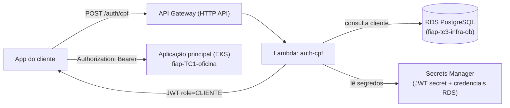

# fiap-tc3-lambda-auth

Function Serverless de autenticação por CPF do Tech Challenge Fase 3 (SOAT/FIAP). Repositório 1 dos 4 exigidos pelo desafio: valida o CPF informado, consulta a existência/status do cliente no banco da oficina e devolve um token JWT compatível com o filtro de segurança da [aplicação principal](https://github.com/MatVicDev/fiap-TC1-oficina).

## Propósito

Substituir o login usuário/senha para o fluxo de cliente final: em vez de credenciais, o cliente se autentica com o próprio CPF. A função:

1. Valida o CPF (dígitos verificadores).
2. Consulta a tabela `clientes` do PostgreSQL gerenciado (RDS) por esse CPF.
3. Se o cliente existe e está `ATIVO`, emite um JWT (`sub=cpf`, `role=CLIENTE`, HS256) assinado com o mesmo segredo usado pela aplicação principal.
4. Se não existe → 404. Se existe mas está `INATIVO` → 403. Se o CPF é inválido → 400.

## Tecnologias

| Tecnologia | Finalidade |
|---|---|
| Python 3.12 | Runtime da Lambda |
| PyJWT | Emissão do JWT (mesmo algoritmo/claims do monólito) |
| psycopg2 | Conexão direta ao RDS PostgreSQL |
| boto3 / AWS Secrets Manager | Credenciais do banco e chave JWT nunca em variável de ambiente em texto puro |
| Terraform | Lambda, IAM role, API Gateway HTTP API, Secrets Manager |
| AWS API Gateway (HTTP API) | Endpoint público `POST /auth/cpf` |
| pytest | Testes do algoritmo de validação de CPF |
| GitHub Actions | CI/CD |

## Arquitetura



Por que a Lambda acessa o banco diretamente, e não via API da aplicação principal: mantém a função de autenticação independente — ela continua funcionando mesmo que o serviço principal esteja fora do ar — e evita expor um endpoint interno de consulta de clientes sem autenticação. Detalhes da decisão em [`docs/RFC-002-estrategia-autenticacao-cpf.md`](../fiap-TC1-oficina/docs/RFC-002-estrategia-autenticacao-cpf.md) do repositório da aplicação principal.

## Contrato da API

**POST `/auth/cpf`**

Requisição:
```json
{ "cpf": "123.456.789-09" }
```

Respostas:
| Status | Situação |
|---|---|
| 200 | `{ "token": "<jwt>" }` |
| 400 | CPF ausente ou inválido |
| 404 | Cliente não cadastrado |
| 403 | Cliente inativo |
| 502 | Falha ao consultar o banco |

Postman/collection: ver [`docs/auth-cpf.postman_collection.json`](./docs/auth-cpf.postman_collection.json).

## Executar e testar localmente

```bash
python3 -m venv .venv && source .venv/bin/activate
pip install -r src/requirements.txt pytest
python -m pytest tests/ -v
```

Os testes de unidade cobrem só o algoritmo de validação de CPF (`cpf_validator.py`); o handler (`lambda_function.py`) depende de RDS/Secrets Manager reais e é validado via smoke test manual após o deploy.

## Deploy

Pré-requisitos: conta AWS, `terraform` >= 1.5, e os repositórios [`fiap-tc3-infra-k8s`](../fiap-tc3-infra-k8s) e [`fiap-tc3-infra-db`](../fiap-tc3-infra-db) já aplicados — este repositório lê a rede e o RDS deles via **SSM Parameter Store** (`/fiap-tc3/<ambiente>/...`), sem precisar de acesso ao state alheio nem de variáveis passadas manualmente.

```bash
cd terraform
terraform init
terraform apply -var="ambiente=homologacao" -var="lambda_zip_path=../build/lambda.zip"
```

O deploy automático (`.github/workflows/ci-cd.yml`) só roda quando a variável de repositório `DEPLOY_TO_AWS` está `true` — enquanto a conta AWS do desafio não é liberada pela FIAP, o pipeline para no job `package` (testes + build do `.zip`), sem tentar aplicar Terraform. Segredo/variável necessários no GitHub para habilitar o deploy: secret `AWS_ROLE_ARN` (OIDC, sem chaves estáticas) e variável `AWS_REGION`.

Branch `main` protegida, deploy só via Pull Request; push em `main` publica em produção, push em `homologacao` publica em homologação (ver `environment:` do job `deploy`).
